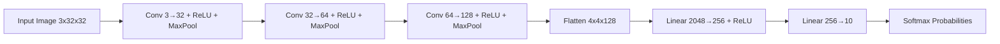

# pixel-sense

**A CNN trained from scratch on CIFAR-10 — classifying real-world images into 10 categories.**


---

## Problem Statement

Image classification is the entry point to computer vision, but most tutorials stop at
"copy this architecture and get a number." **pixel-sense** builds a Convolutional Neural
Network from first principles for CIFAR-10 — 60,000 32×32 color images across 10 classes —
and ships it as a live, interactive demo rather than a static notebook.

## Solution Overview

A 3-block CNN (Conv → ReLU → MaxPool, doubling channels each block) feeds into a small
fully-connected classifier head. The model is trained with Adam + cross-entropy loss and
served through a Streamlit interface deployed on Render, so anyone can upload an image and
get a live prediction with per-class confidence — no GPU, no notebook, no setup required
on the viewer's end.

## Key Features

| Feature | Description |
|---|---|
| From-scratch CNN | Custom 3-conv-block architecture, no pretrained backbone |
| 10-class classification | airplane, automobile, bird, cat, deer, dog, frog, horse, ship, truck |
| Live demo | Streamlit UI deployed on Render — upload an image, get instant predictions |
| Confidence scores | Top-5 class probabilities shown via softmax, not just the top label |
| Reproducible training | train.py retrains and re-exports weights in one command |
| Zero-dependency inference | Preprocessing implemented in plain PyTorch + NumPy — no torchvision needed at serve time |

## Live Demo

Try it live: https://pixel-sense.onrender.com/

Note: Hosted on Render's free tier — the service sleeps after 15 minutes of inactivity.
First load after a sleep period can take 30-90 seconds to wake up. This is expected,
not a bug.

---

## Architecture


Model internals:



Each conv block halves spatial resolution via MaxPool2d(2, 2): 32x32 → 16x16 → 8x8 → 4x4,
while channel depth grows 3 → 32 → 64 → 128, letting the network trade spatial detail for
learned feature richness before the classifier head.

---

## Technology Stack — Complete Breakdown

| Technology | Version | Category | Purpose in Project | Why Chosen | Key Features Used |
|---|---|---|---|---|---|
| PyTorch | 2.13.0 | Deep Learning Framework | Model definition, training loop, autograd, inference | Dynamic graphs, no serving-time dependency needed | nn.Module, nn.Sequential, torch.no_grad, torch.save/load_state_dict |
| NumPy | — | Numerical Computing | Manual image preprocessing (resize, normalize) at inference time | Replaced torchvision.transforms to cut ~100MB+ RAM footprint on Render's free tier | astype, array normalization, permute-equivalent reshaping |
| Streamlit | 1.59.2 | Web UI / Serving | Interactive inference demo — file upload, image display, live predictions | Zero-frontend-code deployment, native Python, works on Render as a plain web service | st.file_uploader, st.cache_resource, st.progress, WebSocket-based rerun model |
| Pillow (PIL) | — | Image I/O | Decoding uploaded images, RGB conversion, resizing | Standard Python imaging library, required by Streamlit's upload pipeline | Image.open, .convert("RGB"), .resize() |
| torchvision | 0.28.0 | Data / Training only | CIFAR-10 dataset loading, dataset-time transforms | Only needed in train.py — not installed in the deployed app to stay under Render's 512MB free-tier RAM limit | CIFAR10 dataset loader, transforms.Compose (training only) |
| Render | — | Hosting | Free web-service hosting for the live demo | Native Python service (no Dockerfile needed), auto-deploy on git push | Auto-deploy from GitHub, $PORT env binding, free CPU tier |

Note: torchvision is intentionally split out of the deployed app's requirements.txt. It
lives only in the training environment. See Troubleshooting for why this matters on
free-tier hosting.

---

## Inference Request Lifecycle

```
1. USER INTERACTION
   User selects an image file in the browser
       -> Streamlit component: st.file_uploader (app.py)
       -> File bytes pushed to server over the existing WebSocket connection

2. SERVER — SCRIPT RERUN
   Streamlit detects new widget state -> reruns app.py top to bottom
       -> uploaded_file is now a BytesIO-like object, not None

3. IMAGE DECODE
   Image.open(uploaded_file).convert("RGB")   [app.py]
       -> Handles PNG/JPEG variants, forces 3-channel RGB

4. PREPROCESSING (manual, no torchvision)
   preprocess(image)   [app.py]
       -> image.resize((32, 32))
       -> np.array(...) / 255.0                     -> [0,1] range
       -> (arr - 0.5) / 0.5                          -> [-1,1] range, matches training normalization
       -> torch.from_numpy(arr).permute(2,0,1)       -> HWC -> CHW
       -> .unsqueeze(0)                              -> add batch dimension

5. MODEL INFERENCE
   load_model()   [app.py, @st.cache_resource — loaded once, reused across reruns]
       -> CNN.forward(input_tensor)   [model.py]
       -> 3x (Conv2d -> ReLU -> MaxPool2d) -> Flatten -> 2x Linear
       -> Returns raw logits, shape (1, 10)

6. POSTPROCESSING
   F.softmax(output, dim=1)[0]   -> probability distribution over 10 classes
       -> torch.topk(probs, 5)         -> top-5 class indices + probabilities

7. RESPONSE
   Streamlit renders st.write() + st.progress() per class
       -> Streamed back to browser over the same WebSocket
```

Note on @st.cache_resource: the model is loaded from model.pth exactly once per
server process, not on every upload — this matters on Render's free tier where cold-start
time and RAM are both constrained.

---

## Data Flow

```
Browser (image bytes)
   -> WebSocket
      -> Streamlit runtime (app.py rerun)
         -> PIL (decode, RGB)
            -> NumPy (manual normalize — no torchvision)
               -> PyTorch tensor (CHW, batched)
                  -> CNN.forward (model.py)
                     -> logits (1x10)
                        -> softmax -> top-5
                           -> WebSocket -> Browser (rendered UI)
```

No database, no persistent storage, no external API calls. State lives only for the
duration of a single browser session (Streamlit's script-rerun model) — nothing is
retained between visits.

---

## Model Details

- Input: 3x32x32 RGB image, normalized to [-1, 1] per channel (mean=0.5, std=0.5)
- Conv blocks: 3x (Conv2d -> ReLU -> MaxPool2d), channels 3->32->64->128
- Classifier head: Linear(2048, 256) -> ReLU -> Linear(256, 10)
- Loss: Cross-entropy
- Optimizer: Adam (default hyperparameters)
- Training: 10 epochs, batch size 64
- Reference result: ~74.7% test accuracy on the CIFAR-10 test split after 10 epochs
  (your own run may vary slightly by seed)

---

## Project Structure

```
pixel-sense/
├── app.py                  # Streamlit app — Render entry point, inference only
├── model.py                 # CNN architecture — shared by train.py and app.py
├── train.py                  # Training script — produces model.pth (needs torchvision)
├── model.pth                  # Trained weights (generated locally, committed for deployment)
├── requirements.txt             # Inference-only deps: torch, streamlit, Pillow, numpy
├── requirements-train.txt        # Training-only extra: torchvision
├── .gitignore
└── README.md
```

## Prerequisites

- Python 3.10+
- pip
- (Optional) CUDA-capable GPU for faster local training

## Installation

```
git clone [https://github.com/KARTHIKAKRISHNA123/pixel-sense.git](https://github.com/KARTHIKAKRISHNA123/pixel-sense.git)
cd pixel-sense
pip install -r requirements.txt
```

## Training

Training needs torchvision for the CIFAR-10 dataset loader — install it separately so
it never ships to production:

```
pip install -r requirements.txt -r requirements-train.txt
python train.py --epochs 10
```

This downloads CIFAR-10 automatically (or reuses an existing ./data folder), trains the
CNN, prints per-epoch loss and final test accuracy, and saves weights to model.pth.

## Running the Demo Locally

```
streamlit run app.py
```

Opens a local UI at http://localhost:8501. Requires model.pth to exist in the same
folder — run train.py first if it's missing.

---

## Deployment

### Deploying to Render (current setup)

Render's free tier deploys a Streamlit app.py as a plain Python web service:

1. Push the repo to GitHub (public or private — Render supports both on the free tier).
2. On Render: New -> Web Service -> connect the repo.
3. Environment: Python 3 (no Dockerfile required).
4. Build Command: pip install -r requirements.txt
5. Start Command:
   streamlit run app.py --server.port=$PORT --server.address=0.0.0.0
6. Instance type: Free.
7. model.pth must already be committed to the repo — Render does not run train.py
   for you.

### Registering as a Submodule in AIML_Knowledge_Base

```
cd "D:\AIML"
git submodule add [https://github.com/KARTHIKAKRISHNA123/pixel-sense.git](https://github.com/KARTHIKAKRISHNA123/pixel-sense.git) "projects/pixel_sense"
git commit -m "feat: add pixel-sense as submodule"
git push origin main
```

---

## Engineering Notes

- Why 3 conv blocks instead of a deeper network? CIFAR-10 images are only 32x32 — three
  MaxPool2d(2,2) layers already reduce the feature map to 4x4, the smallest useful
  spatial resolution before the classifier head.
- Why no torchvision at inference time? Render's free tier caps memory at 512MB.
  torch + torchvision imported together routinely eat 300-400MB before the model or
  Streamlit itself load anything — too tight a margin. Since the app only needs a fixed
  3-step preprocessing pipeline (resize, tensor conversion, normalize), it's reimplemented
  in plain NumPy + PyTorch, numerically identical to the original
  torchvision.transforms.Compose, with zero extra dependency weight.
- Why manual normalization instead of transforms.Normalize? Same math
  ((x - 0.5) / 0.5), just inlined — (arr - 0.5) / 0.5 on a NumPy array before converting
  to a tensor produces the same [-1, 1] range the model was trained on.

## Troubleshooting

| Issue | Cause | Fix |
|---|---|---|
| FileNotFoundError: model.pth | Weights never generated/committed | Run python train.py first, commit model.pth |
| ModuleNotFoundError: torchvision | Code still imports torchvision.transforms after it was removed from requirements.txt | Replace with the manual preprocess() function (see app.py) — no torchvision import needed at inference |
| App hangs on upload, no error, no output | Streamlit's WebSocket connection dying mid-session — common right after a Render free-tier cold start | Wait for the full "waking up" sequence to finish before uploading; if it persists, open in a fresh incognito window |
| Space stuck on "Application Loading" for 2+ minutes | Start command not binding to Render's dynamic $PORT, or an OOM kill from the 512MB free-tier limit | Confirm start command uses --server.port=$PORT --server.address=0.0.0.0; check the Render Logs tab for OOM/kill messages |
| Predictions look random | model.pth doesn't match current model.py architecture | Retrain — mismatched checkpoints can load silently with wrong shapes in some PyTorch versions |

## License

MIT — free to use, modify, and share.