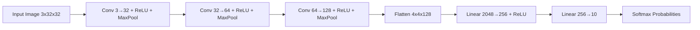

# pixel-sense

**A CNN trained from scratch on CIFAR-10 — classifying real-world images into 10 categories.**


---

## Problem Statement

Image classification is the entry point to computer vision, but most tutorials stop at
"copy this architecture and get a number." **pixel-sense** builds a Convolutional Neural
Network from first principles for CIFAR-10 — 60,000 32×32 color images across 10 classes —
and ships it as a live, interactive demo rather than a static notebook.

## Solution Overview

A 3-block CNN (Conv → ReLU → MaxPool, doubling channels each block) feeds into a small
fully-connected classifier head. The model is trained with Adam + cross-entropy loss and
served through a Gradio interface deployed on Hugging Face Spaces, so anyone can upload an
image and get a live prediction with per-class confidence.

## Key Features

| Feature | Description |
|---|---|
| From-scratch CNN | Custom 3-conv-block architecture, no pretrained backbone |
| 10-class classification | airplane, automobile, bird, cat, deer, dog, frog, horse, ship, truck |
| Live demo | Gradio UI deployed on Hugging Face Spaces — upload an image, get instant predictions |
| Confidence scores | Top-5 class probabilities shown via softmax, not just the top label |
| Reproducible training | `train.py` retrains and re-exports weights in one command |

## Live Demo

🤗 **[Try it on Hugging Face Spaces →](https://huggingface.co/spaces/KARTHIKAKRISHNA123/pixel-sense)**

*(Update this link once your Space is live — see [Deployment](#deployment) below.)*

---

## Architecture



Each conv block halves spatial resolution via `MaxPool2d(2, 2)`: 32×32 → 16×16 → 8×8 → 4×4,
while channel depth grows 3 → 32 → 64 → 128, letting the network trade spatial detail for
learned feature richness before the classifier head.

## Technology Stack

| Technology | Category | Purpose | Why Chosen |
|---|---|---|---|
| PyTorch | Deep Learning Framework | Model definition, training loop, autograd | Dynamic graphs, standard for research-style CNN work |
| torchvision | Data | CIFAR-10 dataset loading, image transforms | Native CIFAR-10 loader + tensor/normalize transforms |
| Gradio | Web UI / Serving | Interactive inference demo | Zero-frontend-code deployment, native HF Spaces integration |
| Pillow | Image I/O | Decoding uploaded images before inference | Required by Gradio's image input pipeline |
| Hugging Face Spaces | Hosting | Free GPU/CPU hosting for the live demo | One-`git push` deployment, shareable public URL |

---

## Model Details

- **Input**: 3×32×32 RGB image, normalized to `[-1, 1]` per channel (mean=0.5, std=0.5)
- **Conv blocks**: 3× `(Conv2d → ReLU → MaxPool2d)`, channels 3→32→64→128
- **Classifier head**: `Linear(2048, 256) → ReLU → Linear(256, 10)`
- **Loss**: Cross-entropy
- **Optimizer**: Adam (default hyperparameters)
- **Training**: 10 epochs, batch size 64
- **Reference result**: ~74.7% test accuracy on the CIFAR-10 test split after 10 epochs
  (your own run may vary slightly by seed)

---

## Project Structure

```
pixel-sense/
├── app.py              # Gradio app — HF Spaces entry point
├── model.py             # CNN architecture (shared by train.py and app.py)
├── train.py              # Training script — produces model.pth
├── model.pth              # Trained weights (generate locally, not in repo by default)
├── requirements.txt        # Python dependencies
├── .gitignore
└── README.md
```

## Prerequisites

- Python 3.10+
- pip
- (Optional) CUDA-capable GPU for faster training

## Installation

```bash
git clone https://github.com/KARTHIKAKRISHNA123/pixel-sense.git
cd pixel-sense
pip install -r requirements.txt
```

## Training

```bash
python train.py --epochs 10
```

This downloads CIFAR-10 automatically (or reuses an existing `./data` folder if you already
have `data_batch_1..5` / `test_batch` / `batches.meta` there), trains the CNN, prints
per-epoch loss and final test accuracy, and saves weights to `model.pth`.

## Running the Demo Locally

```bash
python app.py
```

Opens a local Gradio UI at `http://127.0.0.1:7860`. Requires `model.pth` to exist in the
same folder — run `train.py` first if it's missing.

---

## Deployment

### Deploying to Hugging Face Spaces

1. Create a new Space at [huggingface.co/new-space](https://huggingface.co/new-space):
   - **SDK**: Gradio
   - **Name**: `pixel-sense`
2. Clone the Space repo and copy your files in:
   ```bash
   git clone https://huggingface.co/spaces/KARTHIKAKRISHNA123/pixel-sense
   cd pixel-sense
   cp /path/to/pixel-sense/{app.py,model.py,requirements.txt,README.md,model.pth} .
   ```
3. Push:
   ```bash
   git add .
   git commit -m "Deploy pixel-sense CNN"
   git push
   ```
4. The Space builds automatically from `requirements.txt` and launches `app.py` (as
   declared in the `app_file` field of this README's frontmatter).

> **Note**: `model.pth` must be committed to the Space repo — Spaces don't run `train.py`
> for you. Train locally first, then push the resulting `model.pth` alongside the code.

### Deploying to GitHub

```bash
git init
git add .
git commit -m "Initial commit: pixel-sense CIFAR-10 CNN"
git remote add origin https://github.com/KARTHIKAKRISHNA123/pixel-sense.git
git branch -M main
git push -u origin main
```

### Registering as a Submodule in AIML_Knowledge_Base

```bash
cd "D:\AIML"
git submodule add https://github.com/KARTHIKAKRISHNA123/pixel-sense.git "projects/pixel_sense"
git commit -m "feat: add pixel-sense as submodule"
git push origin main
```

---

## Engineering Notes

- **Why 3 conv blocks instead of a deeper network?** CIFAR-10 images are only 32×32 — three
  `MaxPool2d(2,2)` layers already reduce the feature map to 4×4, the smallest useful
  spatial resolution before the classifier head. A 4th pooling layer would collapse to 2×2
  or smaller, discarding too much spatial information.
- **Why no data augmentation in `train.py`?** Kept intentionally close to the original
  notebook for reproducibility. Adding `RandomCrop`/`RandomHorizontalFlip` is a natural
  next experiment to push past ~75% accuracy.
- **Why softmax output in the Gradio Label component?** Showing top-5 confidences (not
  just the argmax) makes misclassifications interpretable — you can see when the model was
  genuinely torn between two visually similar classes (e.g. cat vs dog).

## Troubleshooting

| Issue | Fix |
|---|---|
| `FileNotFoundError: model.pth` | Run `python train.py` first to generate weights |
| Space build fails on `torch` install | Confirm `requirements.txt` versions are compatible with the Space's Python version (check Space logs) |
| Predictions look random | Verify `model.pth` corresponds to the same `model.py` architecture — mismatched checkpoints load silently wrong shapes in some PyTorch versions |

## License

MIT — free to use, modify, and share.